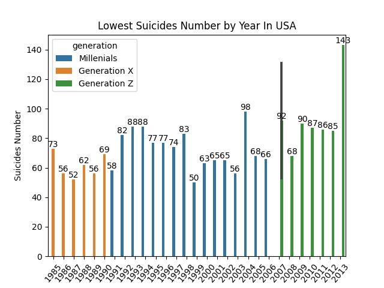
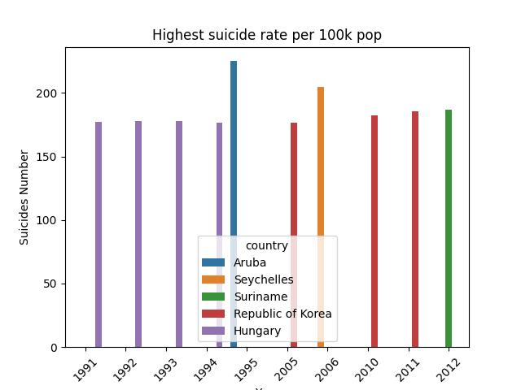
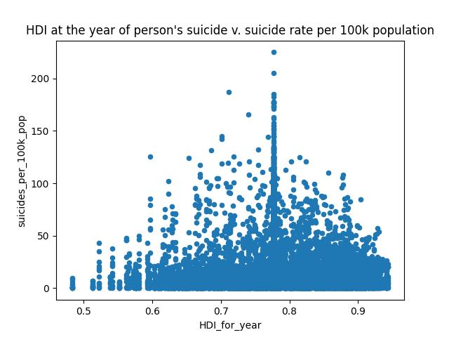
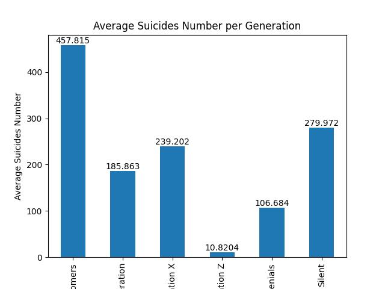
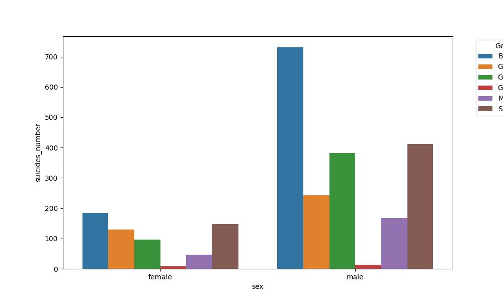
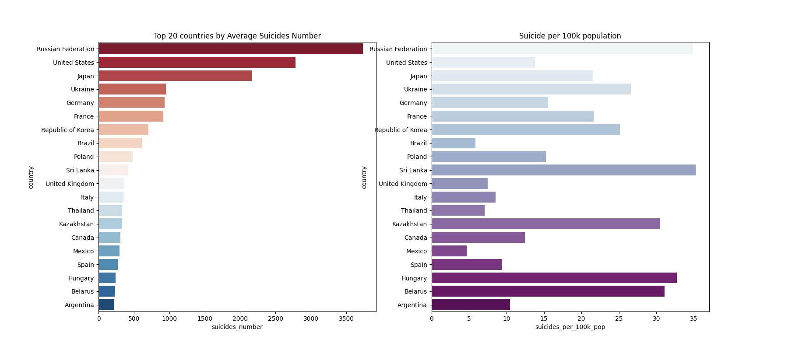

# Suicide-rates

## Table of Contents 

- [Project Overview](#project-overview)
- [Data Sources ](#data-sources)
- [Tools](#tools)
- [Methodology](#methodology)
- [Exploratory Data Analysis](#exploratory-data-analysis)
- [Data Analysis](#data-analysis) 
- [Results Findings](#results-findings)
- [Recommendations](#recommendations)
- [Next Action](#next-action)
- [Tableau](#tableau)

## Project Overview 

This project aim to look at the 

 

 

 

