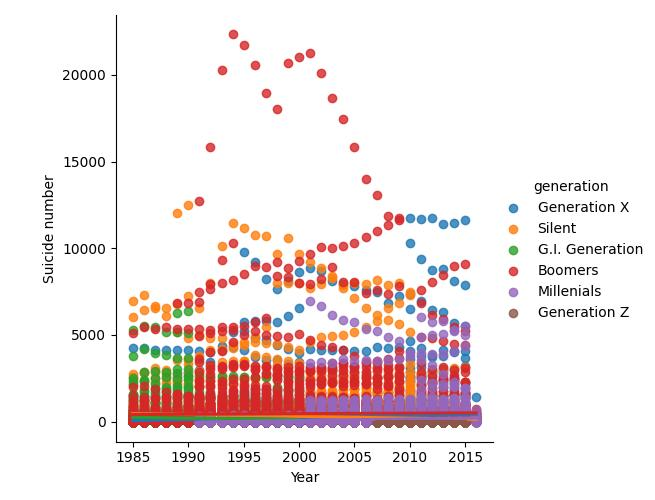

# Suicide-rates

## Table of Contents 

- [Project Overview](#project-overview)
- [Data Sources ](#data-sources)
- [Tools](#tools)
- [Methodology](#methodology)
- [Exploratory Data Analysis](#exploratory-data-analysis)
- [Data Analysis](#data-analysis) 
- [Results Findings](#results-findings)
- [Recommendations](#recommendations)
- [Next Action](#next-action)
- [Tableau](#tableau)

## Project Overview 

This project analyzes global suicide rates using data from the World Health Organization (WHO) and other sources. It examines suicide rates by country, gender, age group, and socioeconomic factors to identify patterns, trends, and correlations with variables like GDP, healthcare spending, and population demographics. 

By leveraging data analysis techniques, this project aims to provide actionable insights that can help policymakers, healthcare professionals, and organizations better understand the factors influencing suicide rates and develop targeted interventions to prevent them.

## Data Sources

Data: The primary dataset used for this analysis is the "master.csv" file. This data was retrieved from the WHO.

## Tools

- Pandas: For data manipulation and handling.

- Matplotlib and Seaborn: For data visualization.

- Tableau: For creating interactive and detailed visualizations

## Methodology
In the initial data preparation phase, the following tasks were performed:

- Data loading and inspection.
- Data cleaning, manipulation, and handling of missing values using Python functions and libraries.
- Performed EDA, to uncover patterns, trends, and relationships, and created visualizations to support these findings.

## Exploratory Data Analysis
EDA involved exploring the data to answer key questions such as:

- What are the global trends in suicide rates over time?
  
- How do suicide rates vary by country, gender, and age group?

- What is the suicide rate in the US, and which generation is most affected?
  
- What is the relationship between suicide rates and socioeconomic factors such as GDP and HDI?
  
- Are there specific regions or demographics that show higher vulnerability to suicide?

## Data Analysis
Here are some examples of the visuals from the analyses:

 

The bar graph displays the highest suicide numbers in the USA over the years. It reveals that the Baby Boomers generation had the highest suicide rate in the US for nearly two decades (1996-2009). From 2010 to 2016, Generation X overtook them as the generation with the highest suicide rate in the country. This can be caused by the unique social, economic, and psychological challenges each generation faces. The Baby Boomers experienced significant life transitions and economic pressures as they aged, contributing to higher suicide rates. In contrast, Generation X faced increasing financial stress, career pressures, and the impact of the 2008 economic recession, which likely influenced the rise in suicide rates among this generation from 2010 to 2016.

The graphs above show that the Russian Federation, the United States, and Japan have the highest suicide rates. The high rates in Russia can be attributed to the severe economic instability, unemployment, and social upheaval following the Soviet Union's collapse in 1991, as well as high alcohol consumption. In the USA, the elevated suicide rates between 2008 and 2015 were largely driven by the economic recession, rising financial stress, increased mental health issues, and insufficient access to mental health care. For Japan, the economic fluctuations, intense social and workplace pressures, social isolation, and cultural stigma surrounding mental health, can be the factors. 

The charts above indicate that males have a significantly higher suicide rate than females, with 77% of suicides committed by males and 23% by females. This can be due to factors such as higher rates of mental health issues among men, societal expectations and pressures, greater use of more lethal methods, and lower likelihood of seeking help compared to women. 

 

The line plot shows that the suicide rate is significantly high for both males and females in the 35 to 54 age group, followed by the 55 to 74 age group surprisingly. Individuals in the 35 to 54 age group may face significant life transitions, such as career changes, financial pressures, and family responsibilities, contributing to stress and mental health issues. The 55 to 74 age group often encounters health problems, physical decline, and chronic illnesses, which can lead to feelings of hopelessness and despair.

The scatter plot above illustrates the number of suicides over the years by generation.

The bar graphs above analyze a country's suicide rate in relation to its Human Development Index (HDI). An HDI score above 0.8 is classified as very high, 0.7 to 0.799 as high, 0.550 to 0.699 as medium, and below 0.550 as low. Based on the observations from these graphs, it appears that a country's HDI does not significantly impact its suicide rate. For instance, nations with high HDI scores, such as the US and Russia, exhibit high suicide rates, while others like Argentina, Belarus, and Hungary, despite having a high HDI, show low suicide rates. Therefore, the data suggests that a country's HDI does not consistently correlate with its suicide rate, indicating that other factors beyond socioeconomic development may play a more significant role in influencing suicide rates.

## Results Findings
The analysis results are summarized as follows:

1. Baby Boomers had the highest suicide rates from 1996 to 2009, followed by Generation X from 2010 to 2016, driven by economic pressures and social challenges specific to each generation.
2. Males have a significantly higher suicide rate than females, with societal pressures, mental health stigma, and the use of more lethal methods contributing to this disparity.
3. The 35 to 54 and 55 to 74 age groups show the highest suicide rates, likely due to midlife crises, health issues, economic stress, and social isolation.
4. Nations like Russia, the US, and Japan exhibit high suicide rates, influenced by economic instability, social pressures, and cultural factors.
5. A country's HDI does not appear to have a consistent impact on its suicide rate, as nations with both high and low HDI scores show varying suicide rates.

## Recommendations
Based on the analysis, the following is recommended:

- Target mental health support by Increasing mental health resources and support for high-risk groups, particularly males, middle-aged adults, and the elderly.
- Address societal pressure by Implementing programs to reduce societal and economic pressures, especially in countries with high suicide rates like the US, Russia, and Japan.
- Combat mental health stigma by promoting awareness and encouraging help-seeking behavior across all generations.
- Governments should develop targeted policies to address the unique challenges faced by different generations, such as financial stress and social isolation.
- Broaden the focus beyond HDI, and recognize that factors beyond socioeconomic development, such as cultural attitudes and social support systems, play crucial roles in suicide prevention efforts.

## Next Action
Further actions to enhance this project could include 
- Integrating additional data sources, such as mental health service availability, unemployment rates, and social support networks, to gain a deeper understanding of factors influencing suicide rates.
- Expand the analysis to include regional or city-level data within countries to identify specific areas with higher suicide rates.
- Utilize advanced statistical techniques, such as regression analysis or machine learning models, to predict suicide rates based on socioeconomic and demographic factors.

## Tableau 
Tableau [Download here](https://public.tableau.com/app/profile/thierno.barry8424/viz/GlobalSuicideRate_17247208350630/Dashboard1)
